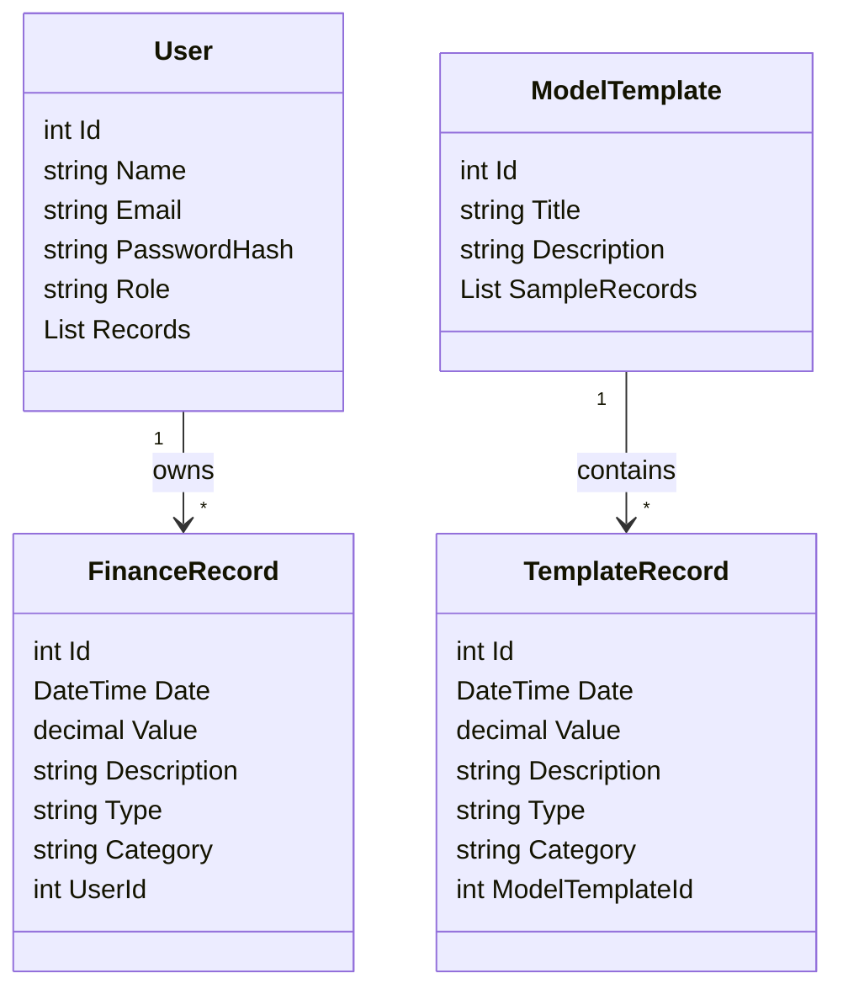
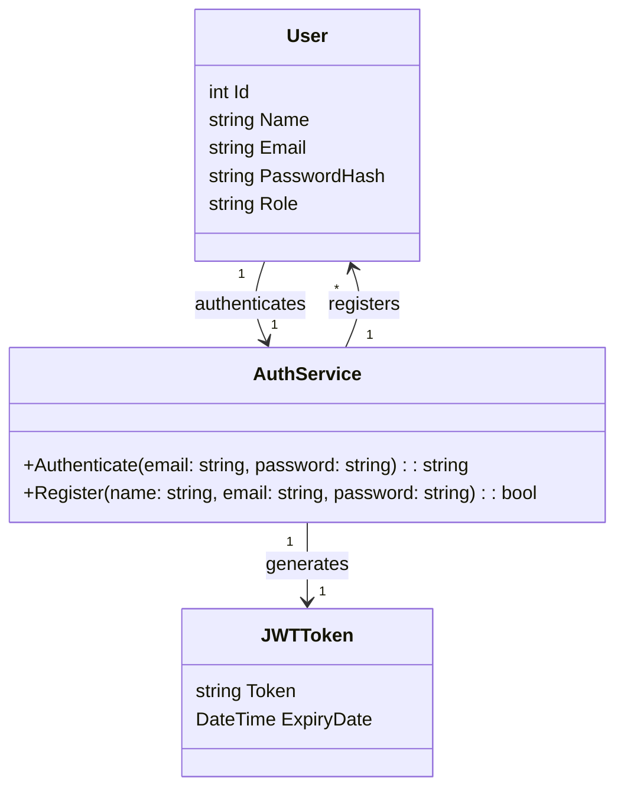

# 💸 NeoBudgetX

> **O futuro do seu controle financeiro.**

NeoBudgetX é uma aplicação web completa para o gerenciamento de finanças pessoais, pensada especialmente para quem costuma registrar seus gastos de forma manual, como em blocos de notas ou planilhas, e busca uma solução mais automatizada, organizada e visualmente agradável.

Com uma interface simples, responsiva e acessível, o NeoBudgetX permite que cada usuário acompanhe seus ganhos, despesas e previsões financeiras mês a mês, de forma clara e prática. Além de funcionalidades como categorização de movimentações, cálculo automático de totais e médias, e exibição de gráficos, a aplicação também oferece a possibilidade de consultar modelos públicos (template de finanças) criados por outros usuários, facilitando a visualização de ideias e métodos diferentes de organização.

Desenvolvido com uma arquitetura robusta utilizando .NET Core no backend, Dapper para persistência de dados e JWT para autenticação segura, o projeto é dividido em camadas bem definidas com CQRS, visando escalabilidade e manutenibilidade. No frontend, conta com HTML, CSS, JavaScript e Bootstrap, garantindo uma experiência fluida e compatível com qualquer dispositivo.

Além disso, o sistema é multiusuário e contempla diferentes perfis:

Admin (usuário autenticado): pode cadastrar, editar, visualizar e excluir suas próprias movimentações financeiras.

Guest (visitante): pode navegar em modelos de finanças públicas para se inspirar na organização de seus próprios dados.

NeoBudgetX não é apenas um app de controle financeiro – é uma ferramenta para desenvolver consciência financeira, com foco em simplicidade, acessibilidade e boas práticas de desenvolvimento de software.

---

## 📌 Features

- Autenticação de usuários com JWT
- Dashboard com totais, médias e gráficos
- Registro de entradas e saídas mensais
- Categorização de despesas
- Separação por usuários (Admin, Guest)
- Modelos públicos para inspiração de novos usuários
- Design responsivo com Bootstrap
- Estrutura limpa e organizada em camadas (API, Domain, Application, Infrastructure, Crosscutting e Services)

---

## 📷 Preview

_(Insira aqui screenshots ou GIFs do projeto em funcionamento, como o login, dashboard e listagem de gastos)_

---

## 🛠️ Tecnologias Utilizadas

### Backend
- C# .NET Core
- Dapper
- SQL Server
- MediatR
- JWT Authentication

### Frontend
- HTML5
- CSS3
- Bootstrap 5
- JavaScript

---

## 🧠 Diagrama de Classes

###  Controle de Finanças:

###  Login/Autenticação:

